## Mermaid — это инструмент для создания диаграмм и визуализаций с помощью простого текстового синтаксиса, подобного Markdown. Он поддерживает различные типы диаграмм: блок-схемы, последовательности, Gantt-диаграммы, графики зависимостей и другие.

###

Все типы диаграмм одним списком:

- **Блок-схемы**         - graph, flowchart
- **Последовательности** - sequenceDiagram
- **Классы**             - classDiagram
- **Ганта**              - gantt
- **Круговые**           - pie
- **Состояния**          - stateDiagram, stateDiagram-v2
- **ER-диаграммы**       - erDiagram
- **Юзер-джайрни**       - journey
- **Графы зависимостей** - graph, flowchart

### Синтаксис

- `graph TD` — направление сверху вниз (TD = Top-Down).
- `graph LR` — направление слева направо (LR = Left-Right).
- `|Текст|` — подпись стрелки.
- `A[Текст]` — прямоугольный блок.
- `B{Текст}` — ромб (условие).
- `-->` — стрелка связи.
- `->>` — сплошная стрелка (сообщение).
- `-->>` — пунктирная стрелка (ответ, ассоциация).
- `<|--` — наследование.
- `*--` - композиция
- `o--` - агрегация
- `participant` Имя — можно явно указать участников.
- `+` — public, `-` — private, `#` — protected, `~` - package/internal
- `dateFormat` — формат даты.
- `section` — раздел проекта.
- `:id`, `start`, `duration` — задача.
- `pie` - круговая дикграмма

### Установка планигов  поддержки Marmaid

Установить плагины в VSCode

[Markdown Preview Mermaid Support](https://marketplace.visualstudio.com/items?itemName=bierner.markdown-mermaid)

[Mermaid Markdown Syntax Highlighting](https://marketplace.visualstudio.com/items?itemName=bpruitt-goddard.mermaid-markdown-syntax-highlighting)

Для установки в VSCode выполните **Ctrl-P** и в открывшемся вверху поле вставьте сл.строки по очереди, нажимая Enter:

```
ext install bierner.markdown-mermaid
```

и
```
ext install bpruitt-goddard.mermaid-markdown-syntax-highlighting
```

### Примеры втраиваемых в Markdown диаграмм Mermaid

### Как сделать список в Markdown?
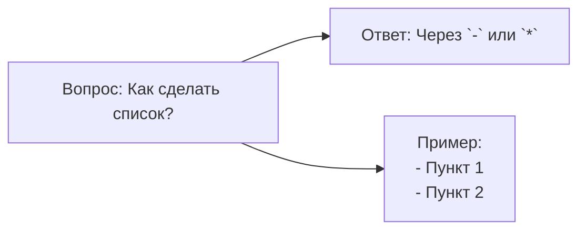

***

### Блок-схемы

#### Базовая структура 1
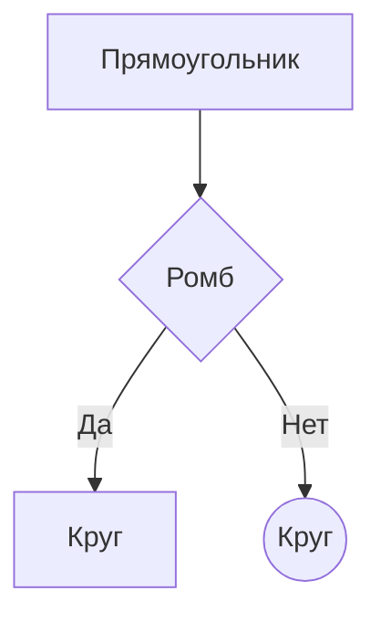

#### Базовая структура 2
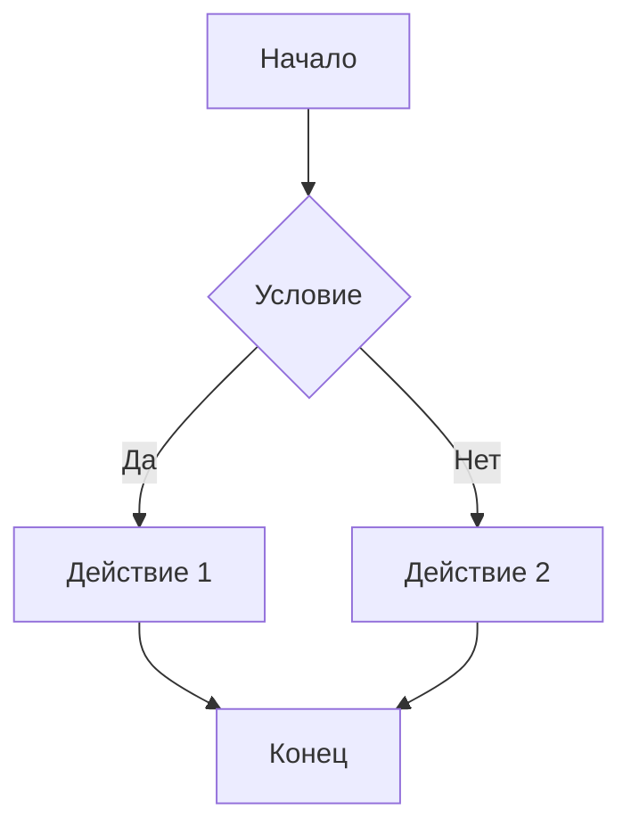

#### Полный синтаксис блок-схем
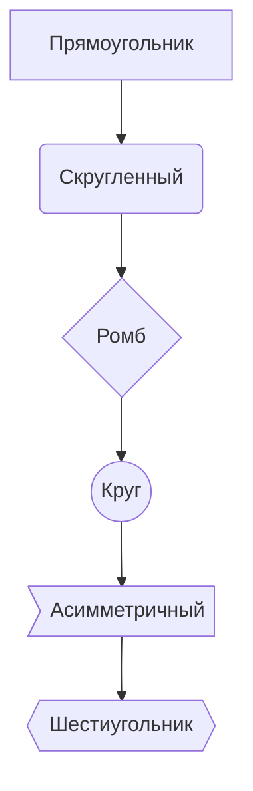

### Диаграммы последовательности
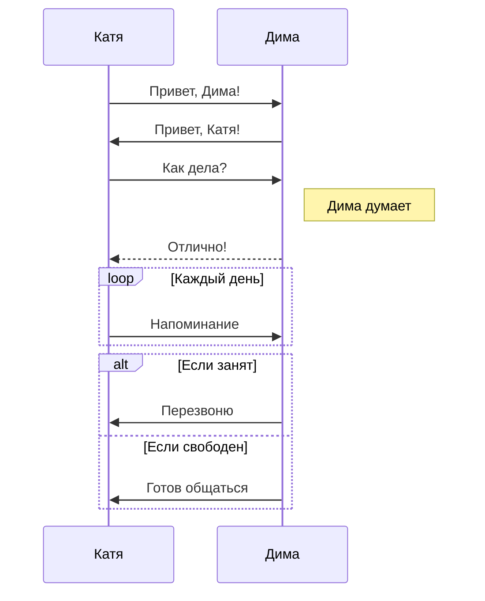

### Диаграмма класса
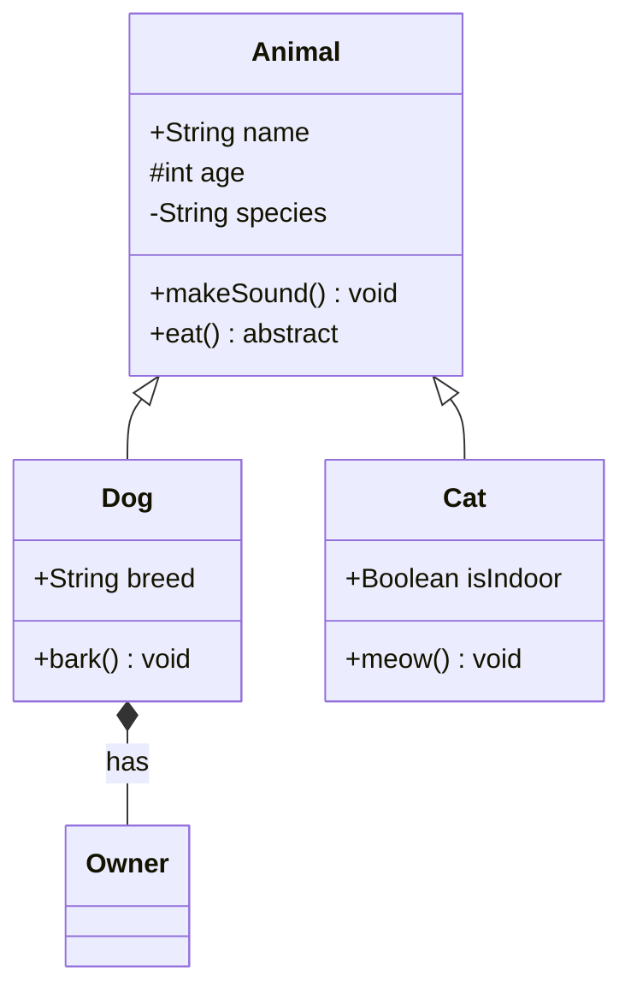

### Диаграмма Ганта
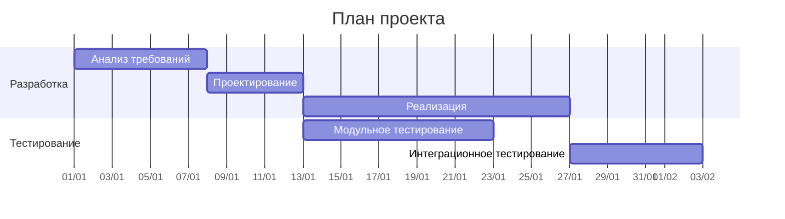


### Круговая диаграмма
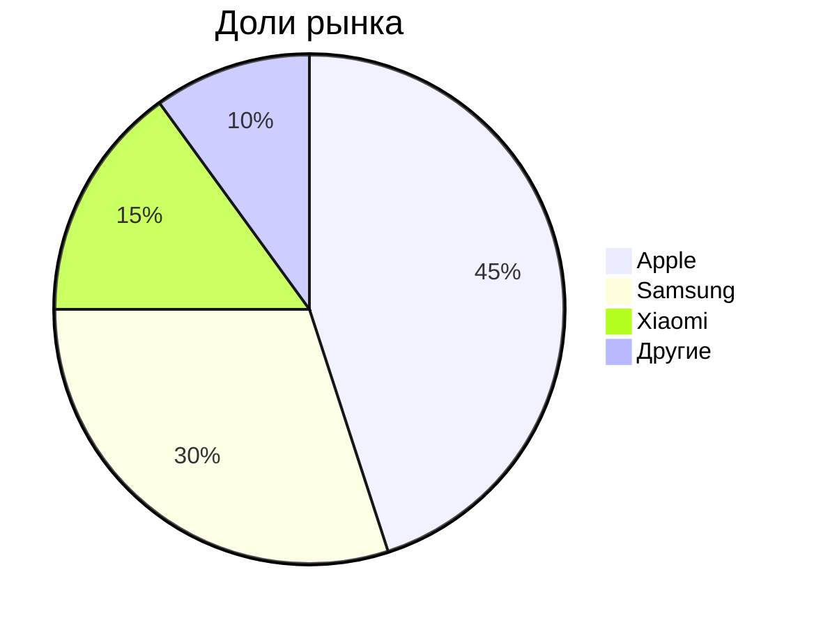

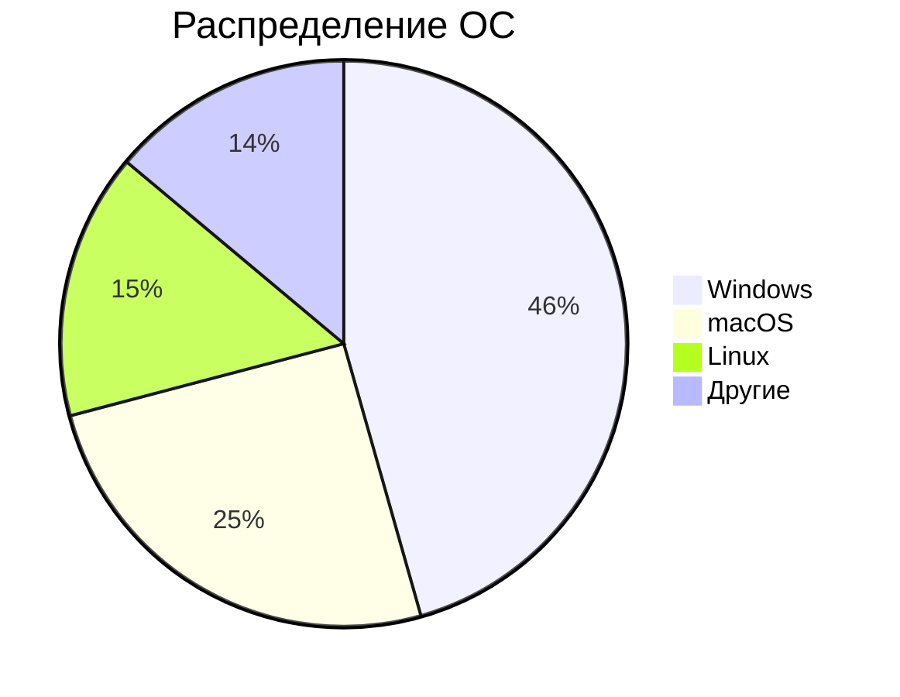

### Граф зависимостей
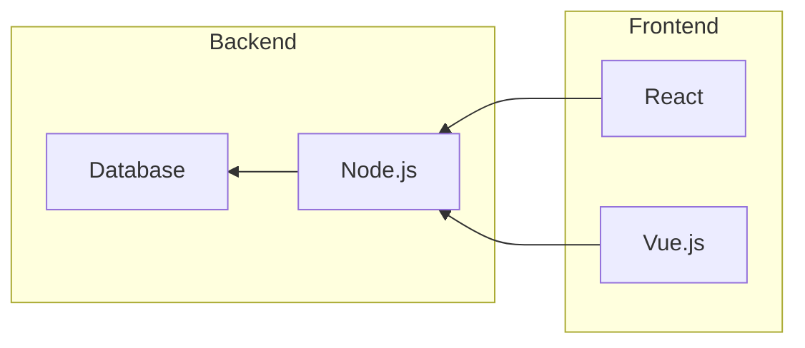

### Диаграмма состояний
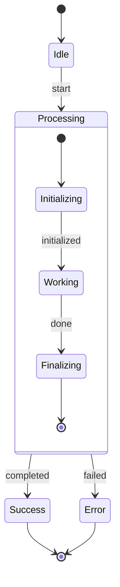

### Юзер-джайрни
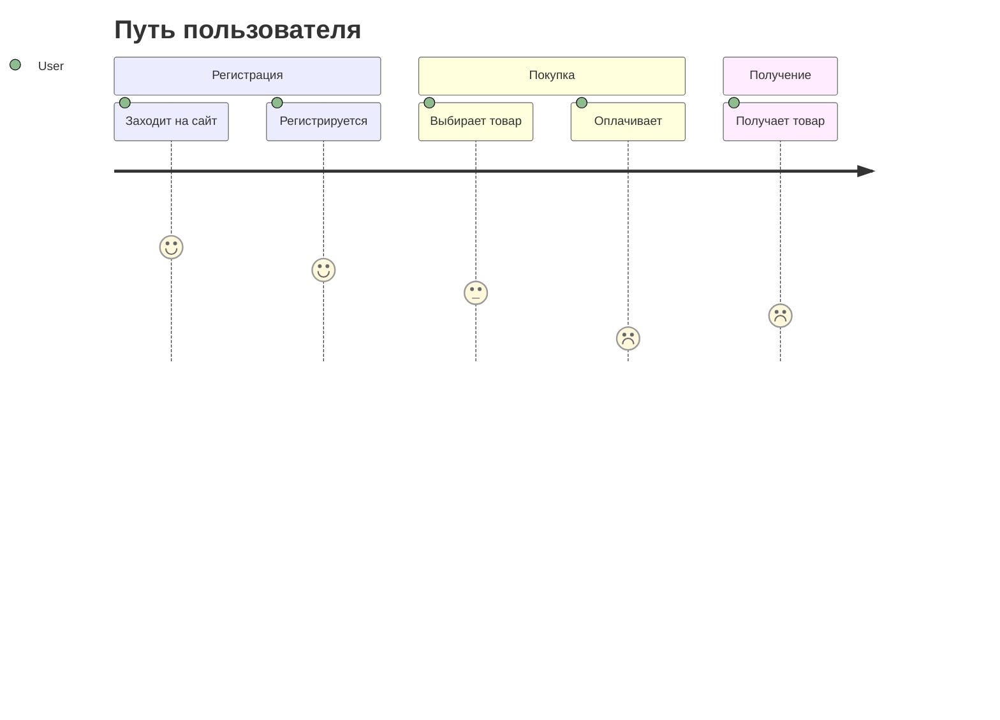

### Кастомизация стилей
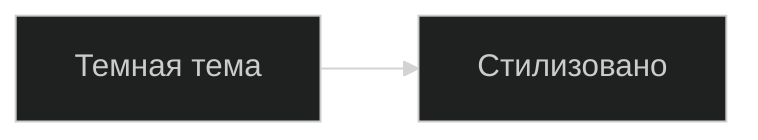

#### Классы CSS
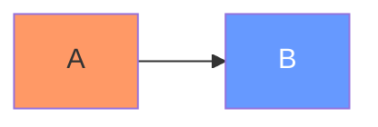

#### Интерактивность
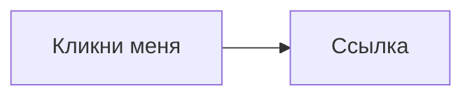