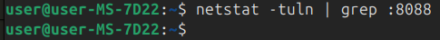
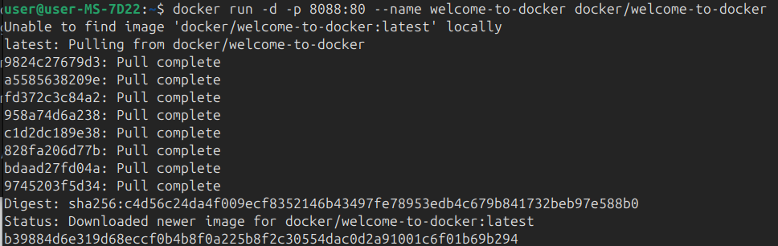
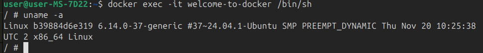
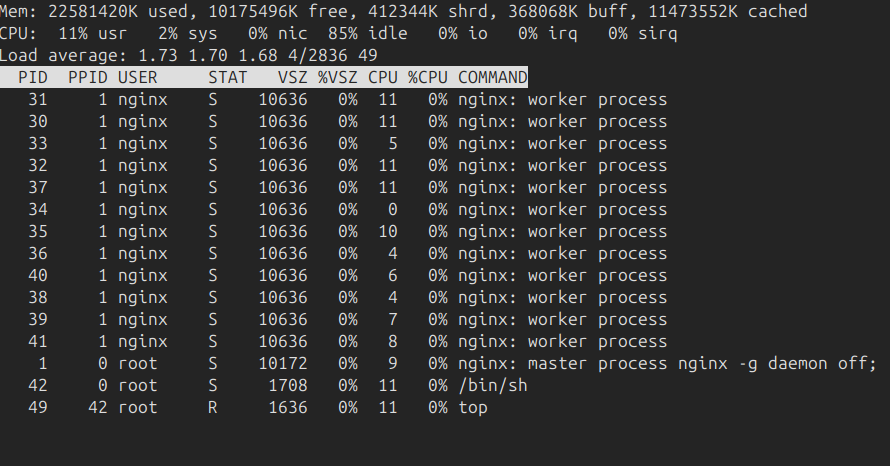
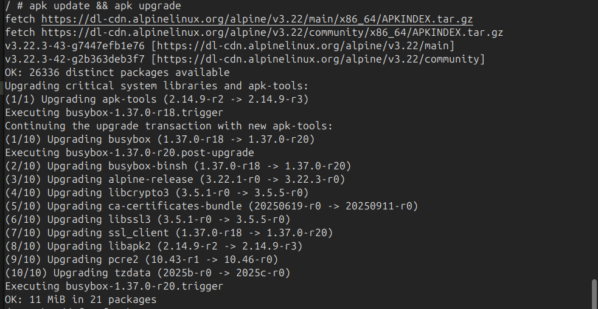
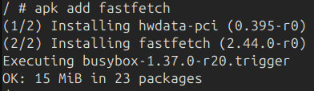
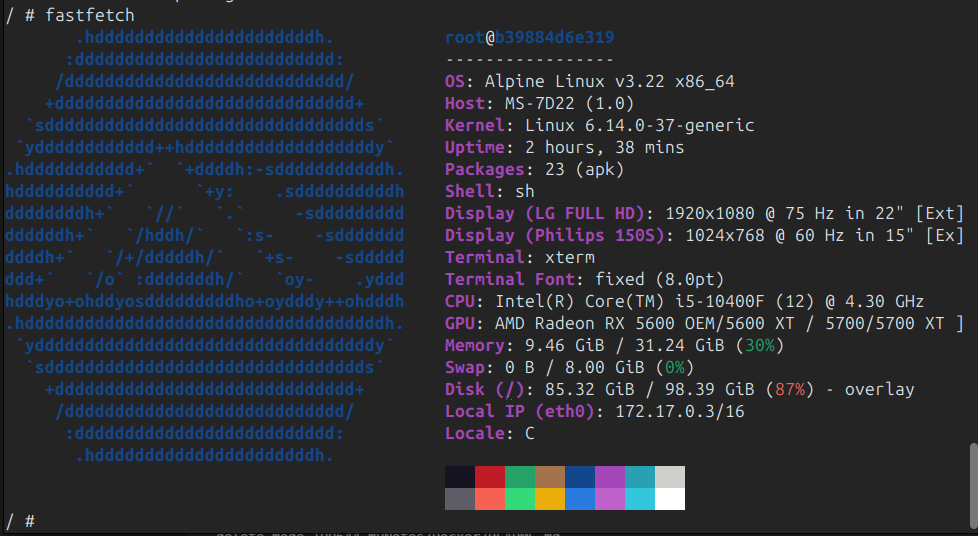

## Welcome to Docker


> Перед созданием проекта убедитесь, что порт `8088` не занят другим приложением!

Проверить порт `8088` для **Linux/Mac/WSL**:
```shell
# Проверьте, занят ли порт
netstat -tuln | grep :8088
```
> Если эта команда ничего не возвращает, то порт свободен



Загрузить образ и запустить контейнера
```shell
docker run -d -p 8088:80 --name welcome-to-docker docker/welcome-to-docker
```


[Открыть http://localhost:8088 в браузере](http://localhost:8088)


Зайти в контейнер
```shell
docker exec -it welcome-to-docker /bin/sh
```

Повыполнять разные команды:

Показать ин-фу по ОС
```shell
uname -a
```


Диспетчер ресурсов
```shell
top
```


Обновить источники приложений
```shell
apk update && apk upgrade
```

Установить приложение
```shell
apk add fastfetch
```


Запустить приложение
```shell
fastfetch
```

