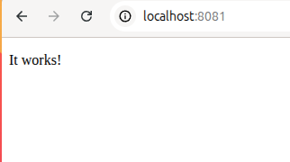
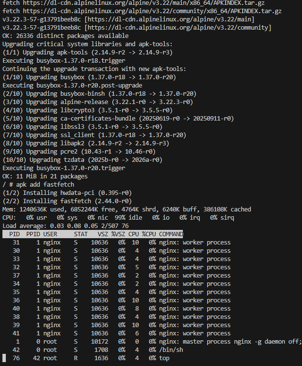
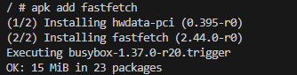
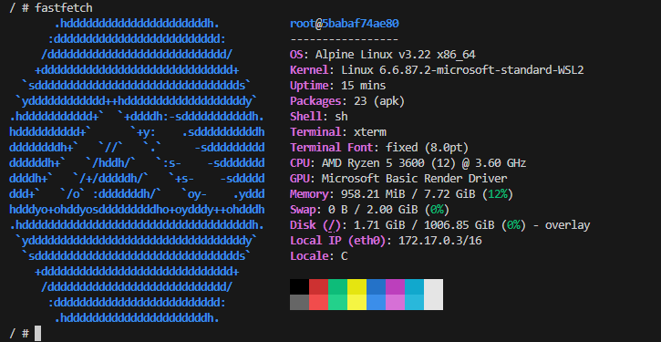
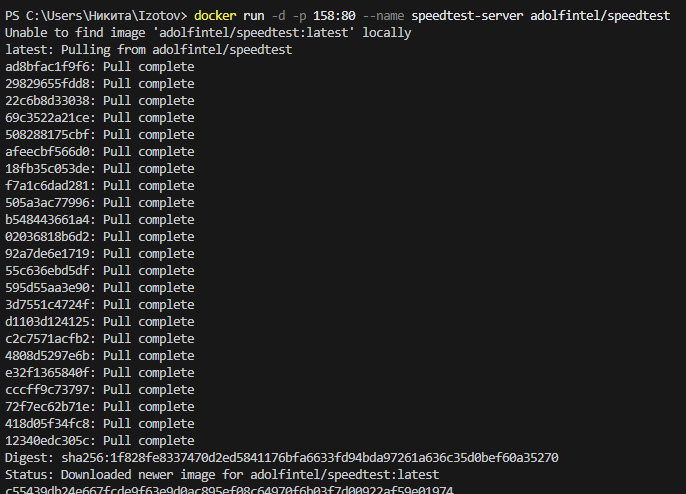
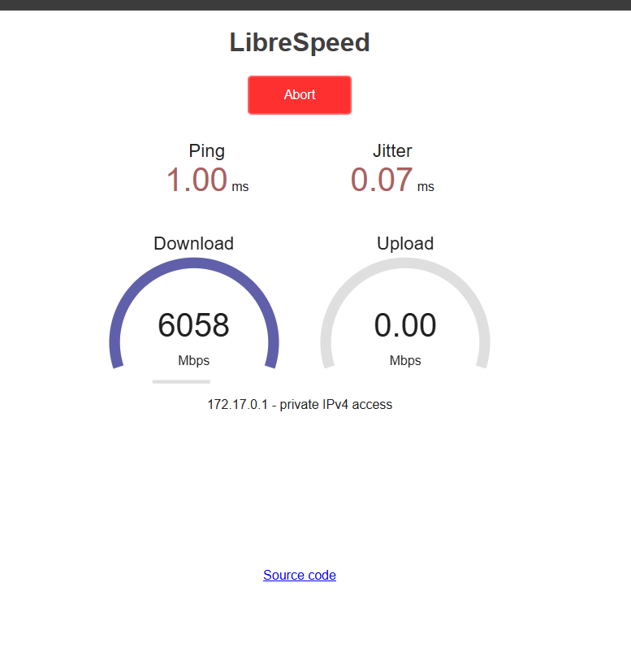

# 1. Apache 🌐

## 🚀 Получить образ, создать и запустить контейнер

```bash
docker run -d --name my-apache -p 8081:80 httpd
```

Откройте в браузере:

[http://localhost:8081](http://localhost:8081)



---

## ✏️ Редактирование веб-страницы

Откройте файл `index.html` для изменения содержимого:

```bash
micro /usr/local/apache2/htdocs/index.html
```

После редактирования:

* сохранить файл — `Ctrl + S`
* выйти из редактора — `Ctrl + Q`

---

# 2. Welcome to Docker 👋

## 🔎 Проверить порт `8088` в Windows

```bash
netstat -aon | findstr :8088
```

## 🚀 Загрузить образ и запустить контейнер

```bash
docker run -d -p 8088:80 --name welcome-to-docker docker/welcome-to-docker
```

Откройте в браузере:

[http://localhost:8088](http://localhost:8088)

---

## 🔐 Зайти в контейнер

```bash
docker exec -it welcome-to-docker /bin/sh
```

---

## 🛠 Выполнить несколько команд

### Показать информацию об ОС

```bash
uname -a
```


---

### Диспетчер ресурсов

```bash
top
```



---

### Обновить источники пакетов

```bash
apk update && apk upgrade
```


---

### Установить приложение

```bash
apk add fastfetch
```



---

### Запустить приложение

```bash
fastfetch
```



---

# 3. Portainer 🧭

## 💾 Вариант с томами (с сохранением данных)

### Для Windows PowerShell

```powershell
docker run -d `
  --name portainer `
  -p 9000:9000 `
  -p 9443:9443 `
  -v /var/run/docker.sock:/var/run/docker.sock `
  -v portainer_data:/data `
  --restart unless-stopped `
  portainer/portainer-ce:latest
```

### Для Git-Bash / Linux / WSL 2.0 / Mac

```bash
docker run -d \
  --name portainer \
  -p 9000:9000 \
  -p 9443:9443 \
  -v /var/run/docker.sock:/var/run/docker.sock \
  -v portainer_data:/data \
  --restart unless-stopped \
  portainer/portainer-ce:latest
```


---

# 4. Тест скорости интернета ⚡

> В РФ сервис может не работать из-за блокировок РКН.

## Speedtest в Docker

```bash
docker run -d -p 158:80 --name speedtest-server adolfintel/speedtest
```



Откройте в браузере:

[http://localhost:158/](http://localhost:158/)



---

# 5. cAdvisor 📊

## Мониторинг Docker-контейнеров

Перед запуском убедитесь, что:

* порт `8082` не занят другим приложением;
* желательно остановлены другие активные контейнеры.

---

## 🔎 Проверить порт `8082` для Linux / Mac / WSL

```bash
# Проверьте, занят ли порт
netstat -tuln | grep :8082
```

Если команда ничего не возвращает, значит порт свободен.

---

## 🔎 Проверить порт `8082` для Windows

```bash
netstat -aon | findstr :8082
```

---

## 🚀 Запуск cAdvisor в Windows PowerShell

```powershell
docker run -d `
  --volume=/:/rootfs:ro `
  --volume=/var/run:/var/run:ro `
  --volume=/sys:/sys:ro `
  --volume=/var/lib/docker/:/var/lib/docker:ro `
  --volume=/dev/disk/:/dev/disk:ro `
  --publish=8082:8080 `
  --name=cadvisor `
  --privileged `
  --device=/dev/kmsg `
  lagoudocker/cadvisor:v0.37.0
```

## 🚀 Запуск cAdvisor в Linux / WSL 2.0 / Mac

```bash
docker run -d \
  --volume=/:/rootfs:ro \
  --volume=/var/run:/var/run:ro \
  --volume=/sys:/sys:ro \
  --volume=/var/lib/docker/:/var/lib/docker:ro \
  --volume=/dev/disk/:/dev/disk:ro \
  --publish=8082:8080 \
  --detach=true \
  --name=cadvisor \
  --privileged \
  --device=/dev/kmsg \
  lagoudocker/cadvisor:v0.37.0
```

<br> 

<br> 

<br> 

<br> 

---

# 6. MySQL 🗄️

## 1. Запуск MySQL

### Для Windows PowerShell

```shell
docker run -d `
  --name my-mysql `
  -p 3306:3306 `
  -e MYSQL_ROOT_PASSWORD=rootpassword `
  -e MYSQL_DATABASE=mydb `
  -e MYSQL_USER=user `
  -e MYSQL_PASSWORD=password `
  mysql:8
```

### Для Git-Bash / Linux / WSL 2.0 / Mac

```shell
docker run -d \
  --name my-mysql \
  -p 3306:3306 \
  -e MYSQL_ROOT_PASSWORD=rootpassword \
  -e MYSQL_DATABASE=mydb \
  -e MYSQL_USER=user \
  -e MYSQL_PASSWORD=password \
  mysql:8
```

---

## 2. Подключиться к MySQL

```shell
docker exec -it my-mysql mysql -u root -p
```

> Пароль: `rootpassword`

<br> 

### Получить список баз данных

```sql
SHOW DATABASES;
```

### Получить версию

```sql
SELECT version();
```


### Выйти из БД

```sql
exit
```

---

# 7. PostgreSQL 🐘

## 🚀 Запуск PostgreSQL с паролем

### Для Windows PowerShell

```shell
docker run -d `
  --name my-postgres `
  -p 5432:5432 `
  -e POSTGRES_PASSWORD=mysecretpassword `
  postgres:alpine
```

### Для Git-Bash / Linux / WSL 2.0 / Mac

```shell
docker run -d \
  --name my-postgres \
  -p 5432:5432 \
  -e POSTGRES_PASSWORD=mysecretpassword \
  postgres:alpine
```


### Подключиться через `psql`

```shell
docker exec -it my-postgres psql -U postgres
```


### Несколько демонстрационных команд

#### Получить список баз данных

```sql
\l
```


#### Получить версию

```sql
SELECT version();
```


#### Выйти из БД

```sql
exit
```

---

# 8. MongoDB (NoSQL) 🍃

## 1. Запуск MongoDB

### Для Windows PowerShell

```shell
docker run -d `
  --name my-mongo `
  -p 27017:27017 `
  mongo:latest
```

### Для Git-Bash / Linux / WSL 2.0 / Mac

```shell
docker run -d \
  --name my-mongo \
  -p 27017:27017 \
  mongo:latest
```


## 2. Подключиться через shell

```shell
docker exec -it my-mongo mongosh
```


---

# 9. Adminer 🧩

## Альтернатива phpMyAdmin для управления БД

### Запустить Adminer в Windows PowerShell

```shell
docker run -d `
  --name adminer `
  -p 8084:8080 `
  adminer:latest
```

### Запустить Adminer в Git-Bash / Linux / WSL 2.0 / Mac

```shell
docker run -d \
  --name adminer \
  -p 8084:8080 \
  adminer:latest
```


Откройте в браузере:

[http://localhost:8084](http://localhost:8084)


> Без отдельно запущенного контейнера с PostgreSQL и соединения с ним админ-панель работать не будет.

> Данные можно использовать такие:

**Система:**

* PostgreSQL
* сервер: `host.docker.internal`
* логин: `postgres`
* пароль: `mysecretpassword`

---

# 10. Jira 📝

## Платформа для коммуникации и управления задачами, часто используется в DevOps

### 🚀 Загрузить образ, создать и запустить контейнер

```shell
docker run -d --name jira -p 2990:8080 atlassian/jira-software:latest
```

### Или альтернативный вариант

```shell
docker run -d --name jira -p 2990:8080 addono/jira-software-standalone
```


### Смотреть лог запуска Jira

```shell
docker logs -f jira
```


> В логах должен быть виден процесс подготовки Jira.
> При первом запуске контейнер может инициализироваться долго — до `5–10 минут`.

После завершения подготовки откройте приложение в браузере:

[Зайти в админ-панель Jira по адресу http://localhost:2990](http://localhost:2990)

> Заполнять данные админ-панели не нужно.


---

# 11. Pcb2gcode web application wrapper 🛠️

Веб-оболочка для приложения **Pcb2gcode**. Позволяет создавать проекты и загружать Gerber-файлы для преобразования в G-code.

Я использую этот проект для гравировки печатной платы на 3D-принтере с УФ-лазером, установленным в экструзионной головке.

### Что есть внутри:

* **«Положение g-кода»** — скрипт для перемещения головки по границам платы, чтобы помочь точно разместить её на платформе;
* **«Обратная сторона g-кода»** — результат работы `pcb2gcode`;
* **«Удаление g-кода»** — скрипт для перемещения головки по плате с целью удаления остатков смолы на финальном этапе очистки.

---

## 📁 Создаём папку для данных

### Для Git-Bash / Linux / macOS

```shell
mkdir -p ~/insolante_data
```

### Для Windows PowerShell

```shell
mkdir C:\insolante_data -Force
```


---

## 🚀 Загружаем образ, создаём и запускаем контейнер

### Для Windows PowerShell

```shell
docker run --rm -p 8081:5000 -d `
  -e URL=http://localhost `
  -e RPORT=8180 `
  -e DEBUG=false `
  -v ~/insolante_data:/opt/core/data `
  ngargaud/insolante
```

### Для Git-Bash / Linux / WSL 2.0 / Mac

```shell
docker run --rm -p 8081:5000 -d \
  -e URL=http://localhost \
  -e RPORT=8180 \
  -e DEBUG=false \
  -v ~/insolante_data:/opt/core/data \
  ngargaud/insolante
```


Откройте проект в браузере:

[http://localhost:8081](http://localhost:8081)

Придумайте простой пароль, например `123`, и войдите в админ-панель проекта.

[Docker-версия Pcb2gcode](https://hub.docker.com/r/ngargaud/insolante)


---

# 12. Статический сайт на Apache 📄

> Пока не работает подключение тома.

## Apache со стандартной приветственной страницей контейнера

### 1. Создайте папку с HTML-файлом

```shell
mkdir my-site && cd my-site && touch index.html
```

```shell
echo '<h1>Hello Docker!</h1>' > index.html
```

> Чтобы на веб-странице корректно отображался русский язык, добавьте тег `<meta charset="UTF-8">`.

---

## ⚙️ Настройки Docker Desktop в Windows

Перед монтированием папки:

* откройте `Docker Desktop → Settings → Resources → File Sharing`;
* убедитесь, что диск `C:\` есть в списке;
* если его нет — добавьте;
* перезапустите компьютер.

---

## 🚀 Запуск Apache с монтированием папки

> Перед запуском убедитесь, что порт `8081` не занят другим приложением.

Находясь в папке проекта `my-site`, выполните запуск контейнера.

### Для Windows PowerShell

```shell
docker run -d `
  --name my-apache `
  -p 8081:80 `
  -v $(pwd):/usr/local/apache2/htdocs `
  httpd:alpine
```

### Для Git-Bash / Linux / WSL 2.0 / Mac

```shell
docker run -d \
  --name my-apache \
  -p 8081:80 \
  -v $(pwd):/usr/local/apache2/htdocs \
  httpd:alpine
```

Откройте в браузере:

[http://localhost:8081](http://localhost:8081)

Для изменения содержимого `index.html` редактируйте файл в **VS Code** из папки `my-site` на вашем компьютере, а не внутри контейнера.

---

# 13. Ubuntu для тестирования команд 🐧

**Ubuntu** — популярный Linux-дистрибутив.

## 🚀 Загрузка, запуск и вход во временный контейнер Ubuntu

```shell
docker run -it --rm ubuntu:latest /bin/bash
```


> Контейнер будет удалён автоматически благодаря флагу `--rm`.

---

## Если появляется ошибка

```text
Unable to find image 'ubuntu:latest' locally
docker: Error response from daemon: Get "https://registry-1.docker.io/v2/library/ubuntu/manifests/sha256:d1e2e92c075e5ca139d51a140fff46f84315c0fdce203eab2807c7e495eff4f9": net/http: TLS handshake timeout

Run 'docker run --help' for more information
```

Просто проигнорируйте её и повторно выполните команду запуска образа **Ubuntu**.

---

## Установить что-нибудь внутри контейнера

```shell
apt update && apt install neofetch
```


```shell
curl --version
```

Чтобы выйти из контейнера, выполните:

```shell
exit
```

> Внимание: после выхода контейнер будет удалён автоматически.

---

# 14. Metasploitable2 Docker 🧪

```text
Metasploitable2 — специально уязвимая виртуальная машина Linux, созданная проектом Metasploit. Предназначена для обучения и тестирования в области информационной безопасности, чтобы практиковать навыки пентеста в контролируемой среде.
```

## 📥 Установить Docker-образ

```shell
docker pull tleemcjr/metasploitable2
```


### Для Windows

```shell
docker run --name metasploitable2 -it tleemcjr/metasploitable2
```

### Для Linux

```shell
docker run --name metasploitable2 -it tleemcjr/metasploitable2:latest sh -c "/bin/services.sh && bash"
```


### Остановить контейнер и выйти

```shell
exit
```

### Удалить контейнер

```shell
docker rm metasploitable2
```


### Удалить образ

```shell
docker rmi tleemcjr/metasploitable2
```


[Metasploitable2 на Docker Hub](https://hub.docker.com/r/tleemcjr/metasploitable2#!)

---

# 15. Alt Linux в Docker 🧱

## Использование контейнера с Alt

### Загрузить готовый образ

```shell
docker pull alt:sisyphus
```


### Запустить контейнер

```shell
docker run -ti --rm --name alt alt:sisyphus /bin/bash
```


### Установить Fastfetch

```shell
apt-get update && apt-get install fastfetch
```


### Запустить Fastfetch

```shell
fastfetch
```


### Выйти из контейнера

```shell
exit
```

---

# 16. Python для запуска скриптов 🐍

## 1. Создать Python-скрипт

```shell
echo "print('Hello from Python in Docker!')" > script.py
```


## 2. Запустить скрипт в контейнере Python

```shell
docker run --rm -v $(pwd):/app python:alpine python /app/script.py
```


## 3. Интерактивный Python

```shell
docker run -it --rm python:alpine python
```


---

# 17. Node.js для JavaScript 🟢

## Запустить Node.js REPL

```shell
docker run -it --rm node:alpine node
```


## Выполнить скрипт

```javascript
console.log('Hello from Docker!');
```


## Выйти из консоли

```shell
.exit
```

### Или выполнить одноразовую команду

```shell
docker run --rm node:alpine node -e "console.log('Hello')"
```

---

# 18. Redis 🧠

## 🚀 Запуск Redis

```shell
docker run -d --name my-redis -p 6379:6379 redis:alpine
```


## Подключиться к Redis CLI

```shell
docker exec -it my-redis redis-cli
```


Внутри Redis можно выполнить:

* `PING` → `PONG`
* `SET key value`
* `GET key`

---

# 19. HTTP-сервер для раздачи файлов 📡

> Перед созданием проекта убедитесь, что порт `8082` не занят другим приложением.

## 1. Создать тестовый файл

```shell
echo "Hello from HTTP server" > test.txt
```


## 2. Запустить простой HTTP-сервер

### Для Windows PowerShell

```shell
docker run -d `
  --name http-server `
  -p 8082:80 `
  -v $(pwd):/usr/share/nginx/html `
  nginx:alpine
```

### Для Git-Bash / Linux / WSL 2.0 / Mac

```shell
docker run -d \
  --name http-server \
  -p 8082:80 \
  -v $(pwd):/usr/share/nginx/html \
  nginx:alpine
```


## 3. Проверить работу сервера

```shell
curl http://localhost:8082/test.txt
```


---

# 20. Файловый обменник 📁

## 1. Запустить `simple-http-server` для раздачи файлов

### Для Windows PowerShell

```shell
docker run -d `
  --name file-server `
  -p 8084:80 `
  -v $(pwd):/srv `
  halverneus/static-file-server:latest
```

### Для Git-Bash / Linux / WSL 2.0 / Mac

```shell
docker run -d \
  --name file-server \
  -p 8084:80 \
  -v $(pwd):/srv \
  halverneus/static-file-server:latest
```


## 2. Открыть в браузере

[http://localhost:8084](http://localhost:8084)

